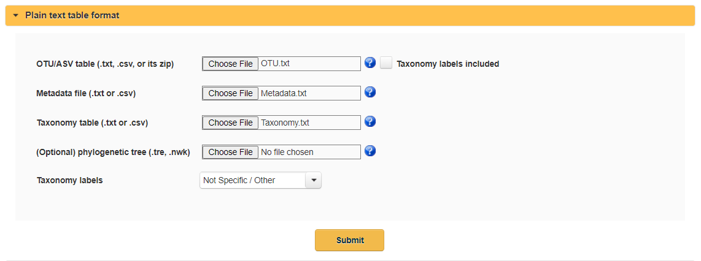
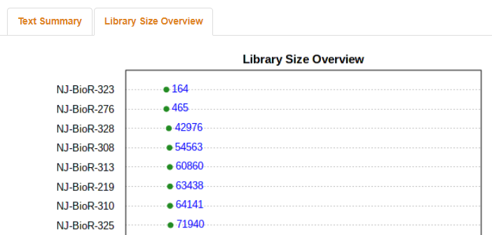
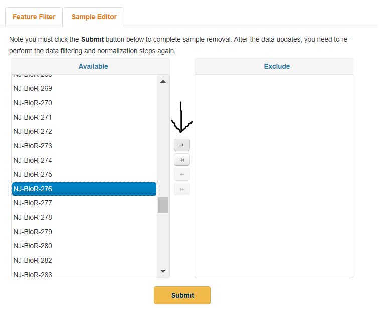
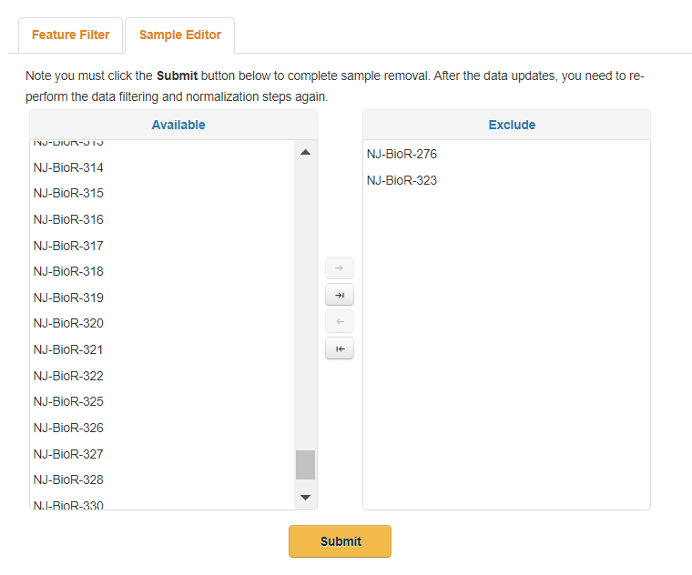
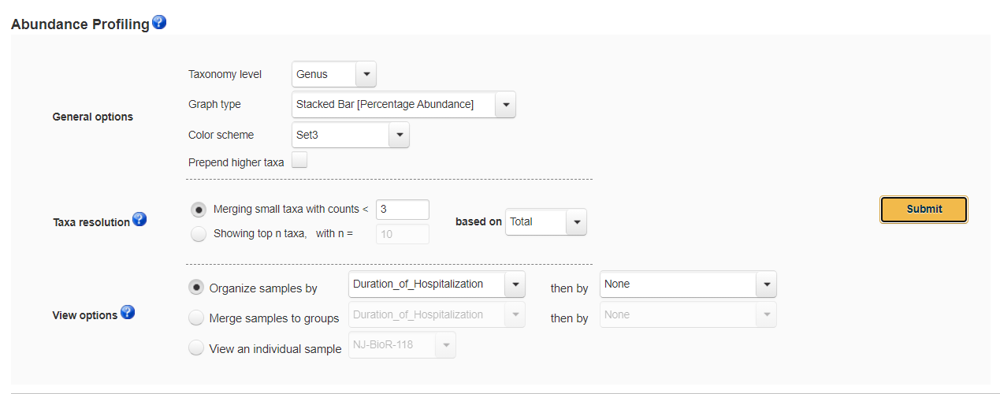
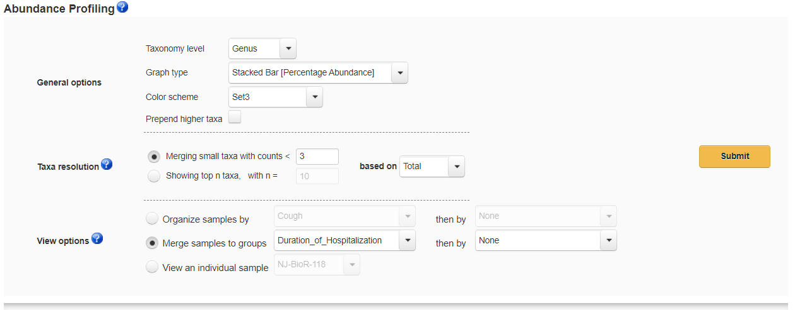
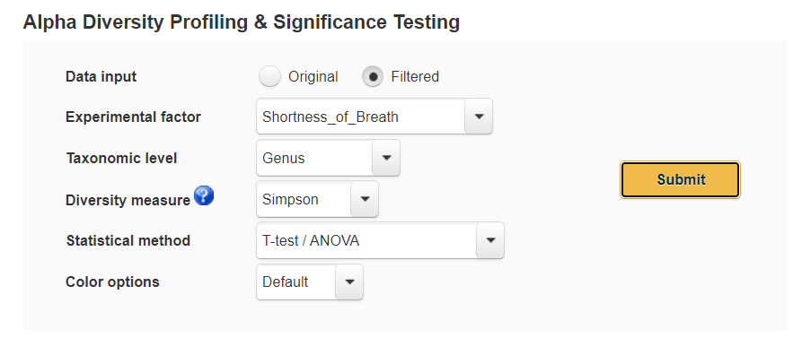

# MicrobiomeAnalyst Tutorial with COVID-19 Patient Metagenomic Data
## This tutorial will briefly teach you how to use some modules of MicrobiomeAnalyst to do metagenomics-based analyses on samples collected from COVID-19 positive patients
### Steps
#### 1. Download these three files from this repository: OTU.txt, Metadata.txt, Taxonomy.txt
#### 2. Visit https://www.microbiomeanalyst.ca/MicrobiomeAnalyst/upload/OtuUploadView.xhtml and upload the files as seen here (and make sure to select "Not Specific/Other" for taxonomy labels:

#### 3. Select "Submit" and wait for processing to complete
#### 4. Navigate to "Library Size Overview" tab and review the data from our samples. Two samples, 323 and 276, have very few counts so we should remove them. We will do this in the next step, for now just remember or write down those numbers.

#### 5. Review the data integrity check tab and click "proceed"
#### 6. In the feature filter tab keep the defaults the same and click "submit"
#### 7. Navigate to the "Sample Editor" tab and we will remove 323 and 276 like we said we would in step 4. To do this find the samples from the list on the left, select them one at a time by clicking on them, and then press the top arrow that points to the right.

#### When you are done your page should look like this:

#### And then click submit
#### 8. Click proceed
#### 9. We will perform the rarefiy the data by selecting the "Rarefy to the minimum library size" option but we will keep the other default options; click submit and then proceed.
#### 10. Now we have arrived at the Analysis Methods Tree. There are many kinds of analyses you can perform here but we will try just two: stacked bar plots and alpha diversity analysis. Let's start with stacked bar plots. Click on "Stacked bar/area plot" (the top leaf of the tree). First let's see how bacterial abundance differs between three groups of patients: short-term, medium-term, and long-term hospitalization durations. Change the options to those seen here:

#### And then click submit. You'll see that there are a lot of bars; take a look and figure out what the different colors mean? Can you notice any patterns? It might be kind of hard to figure out the patterns since there are so many samples so let's merge the samples to groups with the following changes to parameters: 

#### The axis is rearranged in a slightly unhelpful way but you can see, for example, that the abundance of the genus bacilli decreases as hospitalization duration increases.
#### 11. At the top click on "Analysis Overview" to return to the tree we saw before. Go to "Alpha Diversity" and set the options to what you see here:

